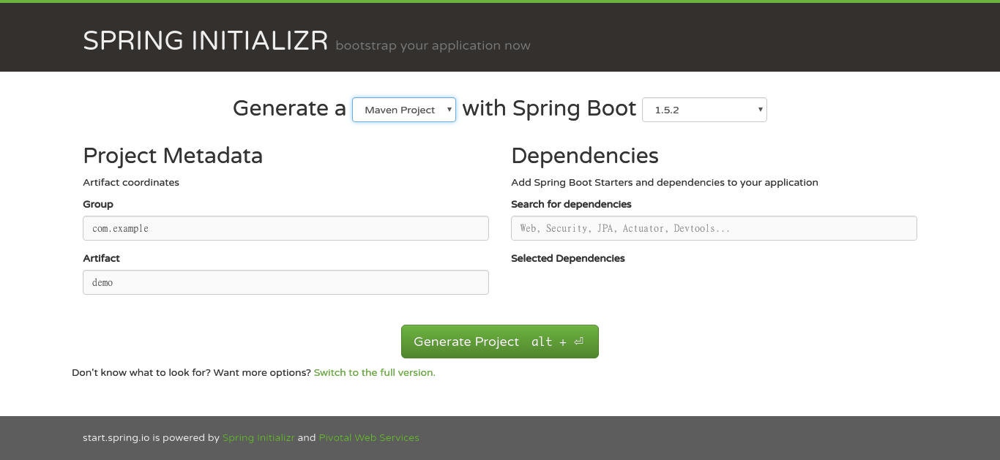
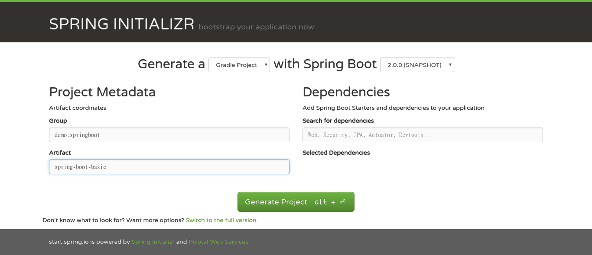

## 前言

最近與 SpringBoot 稍微比較熟了。於是我想藉著這系列文章，深度地研究這個主題。

SpringBoot 說穿了，是希望設計一個 zero config 的 Spring 開發環境。但是，你知道的，用 Spring 用久了，一時之間叫你不要管太多設定，心裡真的會毛毛的。

## 初始化

好，我不多說，先上 [Spring Initializr](https://start.spring.io/) 網站，想好你要做的事，或者我們先從最簡單的開始。



這是 Spring 的一個專案產生器，它可以幫你產生 [Maven](http://maven.apache.org/) 或 [Gradle](https://gradle.org/) 的專案。Group 與 Artifact 的關係，是使用 [Maven Dependency](http://mvnrepository.com/) 的基本觀念，我不詳述。右上角，可以讓你選擇 SpringBoot 的版本，反正我們現在沒有做很深入的事，就來試試最新的版本吧。



我習慣使用 Gradle，版本就選最新的，然後按下 **Generate Project**，你就能拿到你的第一個 SpringBoot 專案。

## 探索

你會拿到一個 zip 檔，解壓縮開來後，會是這樣


基本來說，會有兩個程式：XxxxxxApplication 與 XxxxxxApplicationTest，而前面的名稱，端看你的 Artifact 怎麼命名而定。

如同 Maven 有 ```pom.xml```，Gradle 也有一個中央設定檔：```build.gradle```。我們透過 Spring Initializr 產生的 ```build.gradle``` 內容如下：

```groovy
buildscript {
    ext {
        springBootVersion = '2.0.0.BUILD-SNAPSHOT'
    }
    repositories {
        mavenCentral()
        maven { url "https://repo.spring.io/snapshot" }
        maven { url "https://repo.spring.io/milestone" }
    }
    dependencies {
        classpath("org.springframework.boot:spring-boot-gradle-plugin:${springBootVersion}")
    }
}

apply plugin: 'java'
apply plugin: 'eclipse'
apply plugin: 'org.springframework.boot'
apply plugin: 'io.spring.dependency-management'

version = '0.0.1-SNAPSHOT'
sourceCompatibility = 1.8

repositories {
    mavenCentral()
    maven { url "https://repo.spring.io/snapshot" }
    maven { url "https://repo.spring.io/milestone" }
}

dependencies {
    compile('org.springframework.boot:spring-boot-starter')
    testCompile('org.springframework.boot:spring-boot-starter-test')
}
```

## 第一步

端看這樣的內容，我們可能不知道會有什麼樣的結果。Gradle 有一個指令很好用，它可以列出整個專案的相依性關係：

```
gradle dependencies
```

輸入之後，會發現出現很多資訊，我們挑最重要的 compile 相依性來看看：

```
compileClasspath - Compile classpath for source set 'main'.
\--- org.springframework.boot:spring-boot-starter: -> 2.0.0.BUILD-SNAPSHOT
     +--- org.springframework.boot:spring-boot:2.0.0.BUILD-SNAPSHOT
     |    +--- org.springframework:spring-core:5.0.0.BUILD-SNAPSHOT
     |    \--- org.springframework:spring-context:5.0.0.BUILD-SNAPSHOT
     |         +--- org.springframework:spring-aop:5.0.0.BUILD-SNAPSHOT
     |         |    +--- org.springframework:spring-beans:5.0.0.BUILD-SNAPSHOT
     |         |    |    \--- org.springframework:spring-core:5.0.0.BUILD-SNAPSHOT
     |         |    \--- org.springframework:spring-core:5.0.0.BUILD-SNAPSHOT
     |         +--- org.springframework:spring-beans:5.0.0.BUILD-SNAPSHOT (*)
     |         +--- org.springframework:spring-core:5.0.0.BUILD-SNAPSHOT
     |         \--- org.springframework:spring-expression:5.0.0.BUILD-SNAPSHOT
     |              \--- org.springframework:spring-core:5.0.0.BUILD-SNAPSHOT
     +--- org.springframework.boot:spring-boot-autoconfigure:2.0.0.BUILD-SNAPSHOT
     |    \--- org.springframework.boot:spring-boot:2.0.0.BUILD-SNAPSHOT (*)
     +--- org.springframework.boot:spring-boot-starter-logging:2.0.0.BUILD-SNAPSHOT
     |    +--- ch.qos.logback:logback-classic:1.2.3
     |    |    +--- ch.qos.logback:logback-core:1.2.3
     |    |    \--- org.slf4j:slf4j-api:1.7.25
     |    +--- org.slf4j:jul-to-slf4j:1.7.25
     |    |    \--- org.slf4j:slf4j-api:1.7.25
     |    \--- org.slf4j:log4j-over-slf4j:1.7.25
     |         \--- org.slf4j:slf4j-api:1.7.25
     +--- org.springframework:spring-core:5.0.0.BUILD-SNAPSHOT
     \--- org.yaml:snakeyaml:1.18

compileOnly - Compile only dependencies for source set 'main'.
No dependencies
```

compile 相依性在 Gradle 裡，就是你的系統的 **production code** 所使用的直接相依套件。而在這裡，可以看到有幾組不同用途的套件：

1. spring 開頭的幾個：
    * spring-boot-starter
    * spring-boot
    * spring-boot-autoconfigure
    * spring-core
    * spring-contex
    * spring-aop
    * spring-beans
    * spring-expression
1. 做 log 用的幾個：
    * spring-boot-starter-logging
    * logback-core
    * logback-classic
    * slf4j-api
    * jul-to-slf4j
    * log4j-over-slf4j
1. 處理 YAML 設定檔用的：
    * snakeyaml
    
若加上 testCompile 這類相依，還可以發現：

1. Spring 測試框架：
    * spring-boot-starter-test
    * spring-boot-test
    * spring-boot-test-autoconfigure
    * spring-test
1. 常用的測試框架：
    * junit
    * hamcrest-core
    * hamcrest-library
    * assertj-core
    * mockito-core
1. 以及其他的 utilities

簡單來說，這是一個 Spring 核心的專案，雖然不能讓你建造一個網站，但可以打造一個簡單的純 Java 程式。當然，如果你不需要使用 JavaFX 的 3rd party control 的話，也可以用它來寫 JavaFX。

我們簡單地來寫一個排序法，請參考 [插入排序法](https://zh.wikipedia.org/zh-tw/%E6%8F%92%E5%85%A5%E6%8E%92%E5%BA%8F) 的說明。

在這個專案裡，只有兩個程式：一個 main，一個 main 的測試。

**SpringBootBasicApplication.java**

```java
@SpringBootApplication
public class SpringBootBasicApplication {

	public static void main(String[] args) {
		SpringApplication.run(SpringBootBasicApplication.class, args);
	}
}
```

**SpringBootBasicApplicationTests.java**

```java
@RunWith(SpringRunner.class)
@SpringBootTest
public class SpringBootBasicApplicationTests {

	@Test
	public void contextLoads() {
	}

}
```

我們先試試建置它：

```
gradle clean build
```

然後，它就爆掉了


這怎麼一回事？

我們從這幾個 log 來看：

```
Could not resolve all files for configuration ':compileClasspath'.
> Could not find spring-boot-starter.jar (org.springframework.boot:spring-boot-starter:2.0.0.BUILD-SNAPSHOT).
  Searched in the following locations:
      https://repo.spring.io/snapshot/org/springframework/boot/spring-boot-starter/2.0.0.BUILD-SNAPSHOT/spring-boot-starter-2.0.0.BUILD-20170420.110544-541.jar
> Could not find spring-boot.jar (org.springframework.boot:spring-boot:2.0.0.BUILD-SNAPSHOT).
  Searched in the following locations:
      https://repo.spring.io/snapshot/org/springframework/boot/spring-boot/2.0.0.BUILD-SNAPSHOT/spring-boot-2.0.0.BUILD-20170420.110544-540.jar
> Could not find spring-boot-autoconfigure.jar (org.springframework.boot:spring-boot-autoconfigure:2.0.0.BUILD-SNAPSHOT).
  Searched in the following locations:
      https://repo.spring.io/snapshot/org/springframework/boot/spring-boot-autoconfigure/2.0.0.BUILD-SNAPSHOT/spring-boot-autoconfigure-2.0.0.BUILD-20170420.110544-541.jar
> Could not find spring-boot-starter-logging.jar (org.springframework.boot:spring-boot-starter-logging:2.0.0.BUILD-SNAPSHOT).
  Searched in the following locations:
      https://repo.spring.io/snapshot/org/springframework/boot/spring-boot-starter-logging/2.0.0.BUILD-SNAPSHOT/spring-boot-starter-logging-2.0.0.BUILD-20170420.110544-540.jar

```

或許在你的電腦上沒事，但在我這卻發生了。應該是 Gradle 的快取問題，先清除 Gradle 的快取：

```
rm -rf ~/.gradle
```

重新執行後，便順利建置完成。

但你知道的，這真的沒什麼東西，就算你去執行了，也沒下文。它只是 build 成功罷了。但對一個成熟的框架而言，成功建置是重要的開頭。

## 好的測試是成功的一半

SpringBoot 自帶一個對 Application 的測試，這是為什麼呢？我每一次設定專案，都有這個問題。我們先從它的預設測試程式來看：

```java
@RunWith(SpringRunner.class)
@SpringBootTest
public class SpringBootBasicApplicationTests {
}
```

首先，若你寫過 Spring + JUnit4 的測試，對 ```@RunWith``` 必定有印象，而傳統的參數會是這個 ```SpringJUnit4ClassRunner.class```，在 Spring 的 API 中，可以找到另一個名為 ```SpringRunner``` 的 class，它繼承了 ```SpringJUnit4ClassRunner```，按它的文件來說，其實作用與它的父執輩相當：

> SpringRunner is an alias for the SpringJUnit4ClassRunner.
> - from [Spring Framework API](http://docs.spring.io/spring/docs/5.0.0.BUILD-SNAPSHOT/javadoc-api/org/springframework/test/context/junit4/SpringRunner.html)

所以，這代表幾件事：

1. 你以前寫的 test，使用 ```SpringJUnit4Runner``` 的宣告，換到 SpringBoot 環境裡，不用修改 JUnit 的 Runner 設定。
1. 你現在就能開始用 ```SpringRunner```，因為它是 SpringFramework 的程式。

再其次，跟 SpringBoot 相關的，是 ```@SpringBootTest```，如同 Spring Reference Manual 所寫：

> Spring Boot provides a @SpringBootTest annotation which can be used as an alternative to the standard spring-test @ContextConfiguration annotation when you need Spring Boot features. The annotation works by creating the ApplicationContext used in your tests via SpringApplication.
> - from [SpringBoot Reference](http://docs.spring.io/spring-boot/docs/2.0.0.BUILD-SNAPSHOT/reference/htmlsingle/#boot-features-testing-spring-boot-applications)

這是 SpringBoot 給予預設環境設定之用的 annotation 設定，因為我們目前只有最簡單的工具，所以只要先知道 ```@SpringBootTest``` 會給你的測試程式進行預設的環境設定。

測試程式的關鍵，就在測試的 method，但預設的測試 method 是個空殼，看起來像是希望開發者填些什麼進去。但因為 **Spring Initializr 只是提供你專案的基本環境設**，我翻遍 SpringBoot 的說明，完全沒有告訴你這個 ```contextLoads()``` 應該怎麼寫，這也正常：它只是個提示，不是強制。

但它既然這麼稱呼自己了，我們還是試著來寫一個簡單的測試：

```java
@RunWith(SpringRunner.class)
@SpringBootTest
public class SpringBootBasicApplicationTests {

	@Autowired
	private SpringBootBasicApplication application;

	@Test
	public void contextLoads() {
		assertThat(application).isNotNull();
	}
}
```

這個測試很簡單，只把主程式 inject 進來，並檢查是否有 inject 成功，以確認 Spring 的 ApplicationContext 有起來。因為這樣執行一定是成功的，我就不貼上執行結果了。

## main - 最初的進入點

想當初，在學 C 及 Java 時，main 是個常常接觸的 method，最常寫的除了 print[f] 之外，就是 main 了。但在寫了 Web 的程式之後，與 main 之間，隔了好幾層。但這樣的經驗，在使用 SpringBoot 之後，又轉回來從 main 作為進入點了。

我們先前已經看過主程式，如果忘了的，可以捲上去看看。問題來了，它只寫了一句話：

```java
SpringApplication.run(SpringBootBasicApplication.class, args);
```

這句程式可以看到，它把自己傳入 SpringApplication 裡面執行。然而，main 不是已經在最上層了嗎？我在寫 JavaFX 時，同樣也遇過這個問題，可以參考這段從 JavaFX 的 HelloWorld 擷取出來的程式碼：

```java
public class HelloWorld extends Application {
    
    @Override
    public void start(Stage primaryStage) {
        // 顯示 HelloWorld...
    }
    
    public static void main(String[] args) {
        launch(args);
    }
}
```

在此，同樣是由一個上層的程式（Application）來執行這個 main，在此隱約地可以感覺到是一種 Observer 模式的使用。

然而，在 JavaFX 的主程式，還可以知道真正的進入點是在 start() 裡，但 SpringBoot 呢？我們看它的 main 的上下文，並無其他告訴開發者，他的程式應該從哪裡開始的提示，這怎麼辦呢？

## SpringBoot 的設計方向

SpringBoot 的文件很有趣，當我們看它的 reference 這一章時 [11. Developing your first Spring Boot application](http://docs.spring.io/spring-boot/docs/current/reference/html/getting-started-first-application.html) 會發現其實這個案例，是一個 Web 應用程式。而它的 main 函式正是不需寫入任何內容的一種。

然而，我們要做的這個程式，是什麼呢？我們想開發一個 Web 程式，然後連 ```http://localhost:8080/sorting/insert``` 來看到某些資料嗎？還是我們想開發一個 cli 的程式，它可能是一個 jar 檔，在 command line 下執行 ```java -jar spring-boot-basic.jar```，然後顯示某些執行結果呢？

無可諱言地，SpringBoot 當初設計出來的初衷，雖說是讓 Spring 開發更輕鬆、設定更少，但其實我認為更精確地來說，是讓 Spring 的 Web 應用開發更加輕鬆。它有許多的文件、設定，預設的開發想法都是基於 Web 應用開發的。

但我們仍然要繼續探討它的其他開發面向。首先，我們需要先定義一下這個專案的目標。框架只是提供一個存取各樣資源、工具的方法，真實的應用還是需要開發者面對現實的環境與目標而決定。

## 一個簡單的目標

排序法幾乎是所有演算法中，最基本的知識，你可以上 Google 找到各類排序法的範例程式，但是你的開發生涯中，很難不與它建立關係。排序法探討的，可以簡化為在一個靜態的資料結構中，例如陣列，將內容的次序遞增排列。這內容可以是整數，可以是字串，也可能是物件。在 Java 的物件導向概念中，若要提供可排序的特性，則物件必須實作 Comparable 介面，或提供 Comparator 物件來進行排序。我們不打算進行這麼複雜的實作，從最基本而簡單的一項－整數陣列排序，來開始。

假設，我們有一個陣列 a，我們要對它進行排序。使得 a[i] <= a[j], 而 i < j。要達成這樣的目的，有很多種不同的排序演算法，我們用最簡單但卻很有效率的插入排序法來實作。

好，給定數列、排序之後，通常會伴隨著的，是執行時間，或執行步數等參考數字。於是，我們有一個這樣的目標：統計整數陣列長度由 _1000_ 到 _10000_ 之隨機整數群，數值範圍由 _1~10000_ 之間，其排序的步數、時間之值。並印出在 console 下。

## Command Line 執行

SpringBoot 提供了兩種 Runner 介面讓開發者可以自行定義應用程式啟動時，所應當執行的工作：```ApplicationRunner``` 及 ```CommandLineRunner```。差別在於 ```ApplicationRunner``` 所傳的參數，是另行定義的 ```ApplicationArguments``` 而 ```CommandLineRunner``` 則是接受 main 從 command line 傳入的參數來執行 [[SpringBoot Reference](http://docs.spring.io/spring-boot/docs/2.0.0.BUILD-SNAPSHOT/reference/htmlsingle/#boot-features-command-line-runner)]。看來，```CommandLineRunner``` 是我們所需要的。

於是，我們可以在原本的程式試著加上這一段：

```java
	@Bean
	public CommandLineRunner sortRunner(){
		return args -> {
            log.info("display hello world in command line.");
        };
	}
```

上頭需要宣告 ```Logger``` 的引用：

```java
	private static final Logger log = LoggerFactory.getLogger(SpringBootBasicApplication.class);
```

完整的程式如下：

```java
@SpringBootApplication
public class SpringBootBasicApplication {
	private static final Logger log = LoggerFactory.getLogger(SpringBootBasicApplication.class);

	public static void main(String[] args) {
		SpringApplication.run(SpringBootBasicApplication.class, args);
	}

	@Bean
	public CommandLineRunner sortRunner(){
		return args -> {
            log.info("display hello world in command line.");
        };
	}
}
```

我們可以執行這個 main，並且在 console 下看到這一行：

```
2017-05-08 13:54:00.225  INFO 4877 --- [           main] d.springboot.SpringBootBasicApplication  : display hello world in command line.
```

這代表我們已經可以透過 command line 來執行這個應用程式，並且將結果顯示至 console 之下了。

## 回到測試

主要的排序程式，我們會透過一個介面－```SortService``` 來提供排序的相關功能，因為我們不是要探討重構，所以我會直接寫出目標的程式組織結構。

**SortServiceTest.java**

```java
@RunWith(SpringRunner.class)
@SpringBootTest
public class SortServiceTest {

    @Autowired
    private SortService service;

    @Test
    public void testSort() throws Exception{
        int[] instances = prepareRandomInstances();

        int[] results = service.sort(instances);

        verifySortedResults(results);
    }

    private int[] prepareRandomInstances() {
        return new int[]{5,4,1,3,2};
    }
    
    private void verifySortedResults(int[] results) {
        int before = results[0];

        for(int i=1; i<results.length; i++){
            int later = results[i];

            assertThat(before).isLessThanOrEqualTo(later);

            before = later;
        }
    }
}
```

測試排序很簡單，執行完後拿前面與後面的數字比較就好。執行之後，會發現缺少應當有的實作類別。沒關係，我們既然已經交待完 SpringBoot 的基本架構，剩下的部份，可以用程式碼來說明。

## Production code

**SortService.java**

```java
public interface SortService {
    int[] sort(int[] instances);
}
```

**SortServiceImpl.java**

```java
@Service
public class SortServiceImpl implements SortService {

    @Override
    public int[] sort(int[] instances) {
        for (int i = 1; i < instances.length; i++) {
            insert(instances, i, instances[i]);
        }

        return instances;
    }

    private void insert(int[] instances, int pos, int value) {
        int flag = pos - 1;

        while (flag >= 0 && instances[flag] > value) {
            instances[flag + 1] = instances[flag];
            flag--;
        }

        instances[flag + 1] = value;
    }
}
```

加上了實作類別後，測試執行應當能成功。

## 加上統計功能

最後，我們要來實現一開始說到，這個專案的排序統計功能。

我們先在 ```build.gradle``` 引入一個好用的工具

```groovy
compile('org.javatuples:javatuples:1.2')
```

然後，增加一個統計用的類別：

**SortStats.java**

```java
public class SortStats {

    private static final BigDecimal NANOS_TO_SEC = BigDecimal.valueOf(1000000000L);
    private static final String STRING_TMPL = "本次排序數列大小為 %1$d，排序時間為 %2$f 秒，執行步數為 %3$d";

    public static SortStats getInstanceBySize(int size) {
        return new SortStats(size);
    }

    private long steps = 0L;
    private double elapsed = 0.0;
    private int size = 0;

    private Instant startTime;
    private Instant stopTime;
    private Duration elapsedTime = Duration.ZERO;

    public SortStats() {}

    public SortStats(int size) {
        this.size = size;
    }

    public void startTimer() {
        startTime = Instant.now();
    }

    public void stopTimer() {
        stopTime = Instant.now();
        elapsedTime = elapsedTime.plus(Duration.between(startTime, stopTime));
    }

    public long getSteps() {
        return steps;
    }

    public void setSteps(long steps) {
        this.steps = steps;
    }

    public void addSteps(long steps) {
        this.steps += steps;
    }

    public double getElapsed() {
        if (this.elapsed == 0) {
            this.elapsed = BigDecimal.valueOf(elapsedTime.toNanos())
                                     .divide(NANOS_TO_SEC).doubleValue();
        }
        return elapsed;
    }

    public int getSize() {
        return size;
    }

    public String toString() {
        return String.format(STRING_TMPL, getSize(), getElapsed(), getSteps());
    }
}
```

最後，修改一下測試與 Service

**SortServiceTest.java**

```java
@RunWith(SpringRunner.class)
@SpringBootTest
public class SortServiceTest {
    private static final Logger log = LoggerFactory.getLogger(SortServiceTest.class);

    @Autowired
    private SortService service;

    @Test
    public void testSort() throws Exception {
        int[] instances = prepareRandomInstances();

        Pair<SortStats, int[]> results = service.sort(instances);

        verifySortedStats(results.getValue0());
        verifySortedValues(results.getValue1());
    }

    private int[] prepareRandomInstances() {
        return new int[]{5, 4, 1, 3, 2};
    }

    private void verifySortedStats(SortStats stats) {
        assertThat(stats).isNotNull();

        log.info(stats.toString());
    }

    private void verifySortedValues(int[] sorted) {
        int before = sorted[0];

        for (int i = 1; i < sorted.length; i++) {
            int later = sorted[i];

            assertThat(before).isLessThanOrEqualTo(later);

            before = later;
        }
    }
}
```

**SortServiceImpl.java**

```java
@Service
public class SortServiceImpl implements SortService {

    @Override
    public Pair<SortStats, int[]> sort(int[] instances) {
        SortStats stats = SortStats.getInstanceBySize(instances.length);

        stats.startTimer();

        for (int i = 1; i < instances.length; i++) {
            stats.addSteps(insert(instances, i, instances[i]));
        }

        stats.stopTimer();

        return Pair.with(stats, instances);
    }

    private long insert(int[] instances, int pos, int value) {
        long steps = 0L;

        int flag = pos - 1;

        while (flag >= 0 && instances[flag] > value) {
            instances[flag + 1] = instances[flag];
            flag--;
            steps++;
        }

        instances[flag + 1] = value;

        return steps;
    }
}
```

最後，我們把核心邏輯都寫完了，要決定把執行邏輯寫在 CommandLineRunner 裡，亦或是寫在另一個地方。但因為這個示範專案不是為了說明排序法的功用，所以我們直接寫在 CommandLineRunner 裡吧。

**SpringBootBasicApplication.java**

```java
@SpringBootApplication
public class SpringBootBasicApplication {
    private static final Logger log = LoggerFactory.getLogger(SpringBootBasicApplication.class);
    private static final int SIZE = 100000;
    private static final int MAX_BOUND = 100000;

    public static void main(String[] args) {
        SpringApplication.run(SpringBootBasicApplication.class, args);
    }

    @Autowired
    private SortService service;

    @Bean
    public CommandLineRunner sortRunner() {
        return args -> {
            int[] instances = getRandomizedIntegers(SIZE);

            Pair<SortStats, int[]> results = service.sort(instances);

            log.info(results.getValue0().toString());
        };
    }

    private int[] getRandomizedIntegers(int size) {
        int[] instances = new int[size];

        Random rnd = new Random(System.currentTimeMillis());

        for (int i = 0; i < instances.length; i++) {
            instances[i] = rnd.nextInt(MAX_BOUND);
        }

        return instances;
    }
}
```

程式可以參考 [GitHub](https://github.com/ProgrammerAnonymous/spring-boot-demo/tree/master/spring-boot-basic) 上的專案。